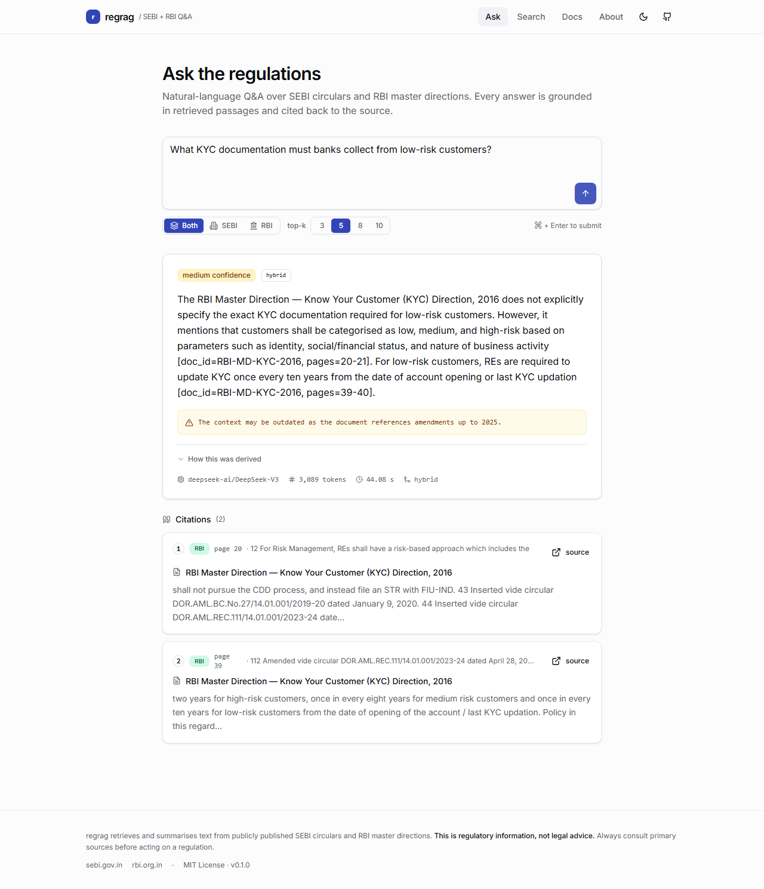
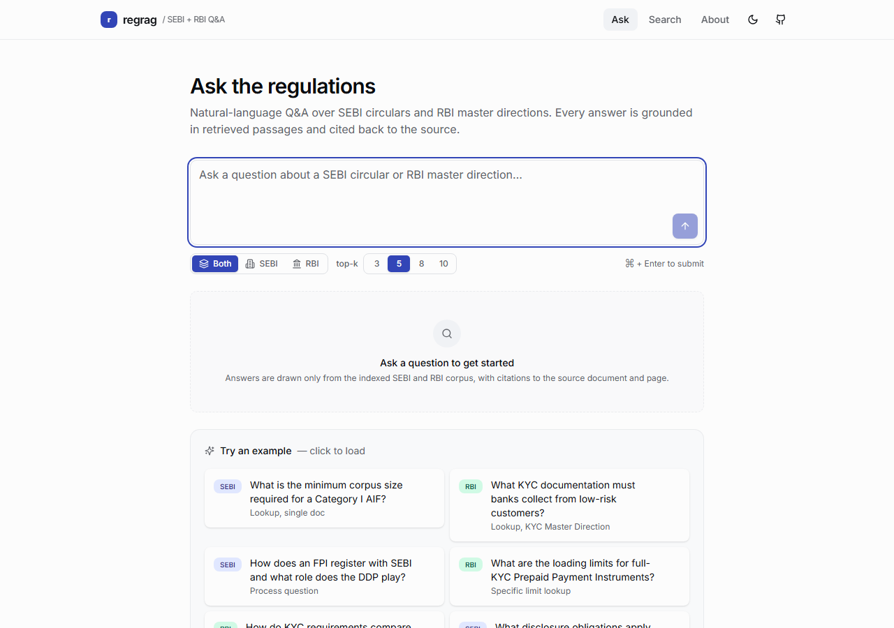
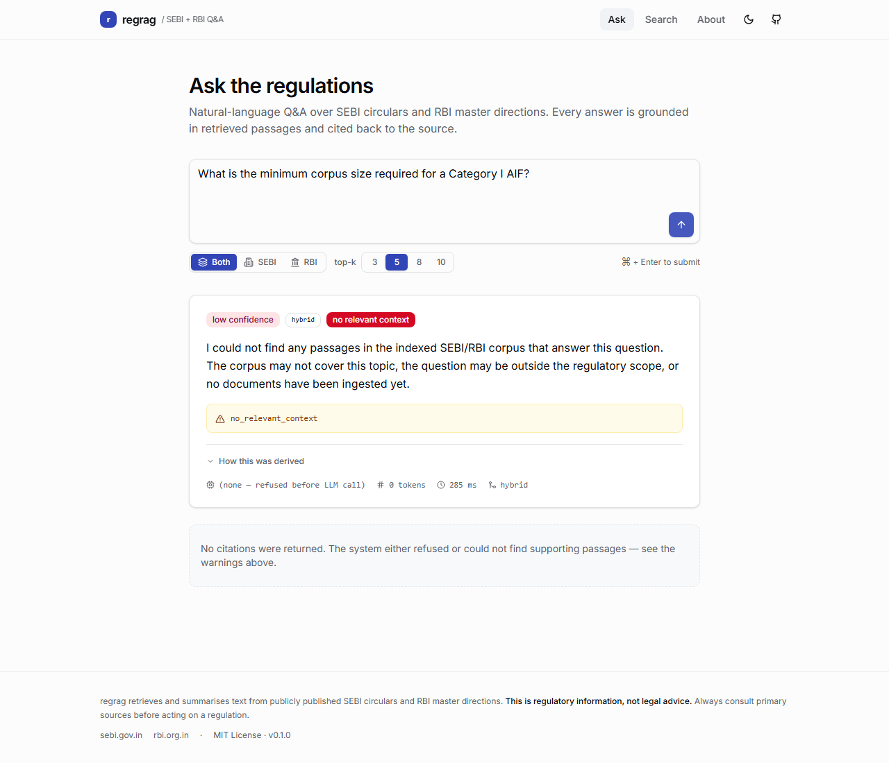
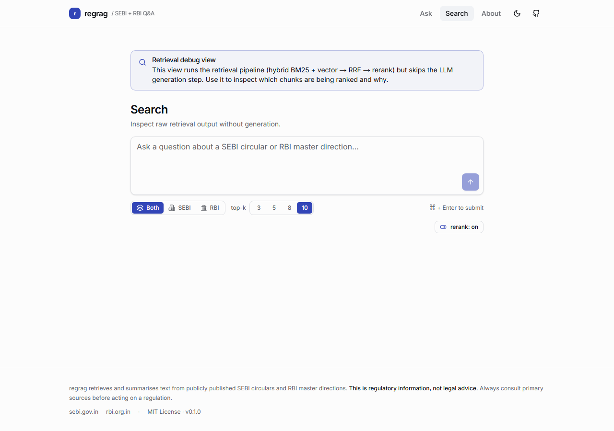
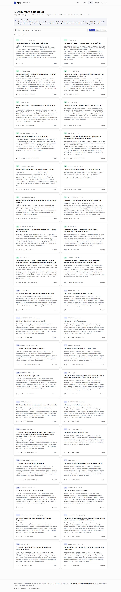
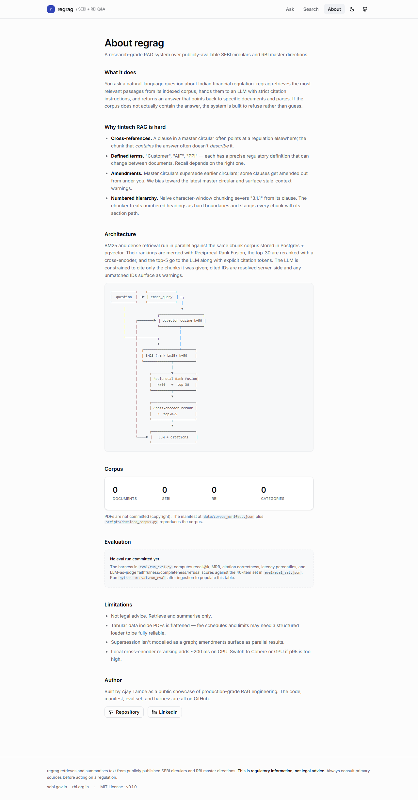

# regrag — RAG over Indian financial regulatory documents

A hybrid retrieval-augmented question-answering system over publicly-available
SEBI circulars and RBI master directions. Ask a natural-language question;
get a cited answer drawn only from the indexed corpus.

> **This is regulatory information, not legal advice.** Every response from
> the system carries the same disclaimer.

The repo ships a FastAPI backend, a Next.js + Tailwind frontend, and an
end-to-end evaluation harness. `docker compose up` brings up Postgres +
pgvector, the API on `:8000`, and the web UI on `:3000`.

---

## Screenshots

### `/` — full RAG flow over the ingested corpus



End-to-end response on the live stack: the question goes through hybrid
retrieval (BM25 + vector) → RRF fusion → cross-encoder rerank →
DeepSeek-V3 on DeepInfra. Every claim in the answer body has an inline
citation token like `[doc_id=RBI-MD-KYC-2016, pages=20-21]`, the
"context may be outdated" warning is preserved (no master-circular
amendment graph yet), and the citation cards below show the supporting
passages with a `source` link to the RBI master direction PDF.

### Other states and pages

| | |
| --- | --- |
|  |  |
| **`/`** — empty state with the example-question grid | **`/`** — refusal flow before any corpus is ingested: low-confidence pill, `no_relevant_context` warning, `(none — refused before LLM call)`, 285 ms latency |
|  |  |
| **`/search`** — retrieval debug view (BM25 + vector → RRF → rerank) | **`/documents`** — full corpus catalogue, 36 cards with regulator pill / preview / page count / source link |
|  | |
| **`/about`** — architecture, corpus stats (36 / 20 / 16), eval table |  |

> All six images are captured from the live `docker compose up` stack
> against the production web container. After you ingest the corpus, rerun
> [`scripts/capture_screenshots.mjs`](scripts/capture_screenshots.mjs)
> (instructions in [docs/screenshots.md](docs/screenshots.md)) to swap the
> refusal screenshot for an answer-with-citations one.

---

## What it does

- Ingests ~35 public regulatory PDFs from SEBI and RBI.
- Extracts and cleans text, chunks it with awareness of document structure
  (numbered clauses, sections), embeds each chunk with `BAAI/bge-small-en-v1.5`
  (384-d), and indexes both the embeddings (`pgvector`) and a BM25 view of
  the same chunks.
- On a question: runs BM25 and dense retrieval **in parallel**, fuses the
  results with **Reciprocal Rank Fusion**, reranks the top-30 with a
  cross-encoder (`BAAI/bge-reranker-base` by default; Cohere `rerank-v3` is
  optional), and synthesises an answer with **explicit citations** using
  Anthropic Claude or OpenAI GPT (swappable via `LLM_PROVIDER`).
- Every claim must be backed by a passage from the retrieved set; if context
  is insufficient the system **refuses** rather than hallucinate.

---

## Why fintech RAG is hard

Indian financial regulations are unusually punishing for naive RAG:

1. **Cross-references everywhere.** A clause in the SEBI Mutual Funds master
   circular routinely points at "Regulation 25 of SEBI (Mutual Funds)
   Regulations, 1996" or "the master circular dated XX/YY/ZZZZ". The chunk
   that *contains* the answer often doesn't *describe* it.
2. **Defined terms.** "Customer", "AIF", "PPI", "ANBC" — each has a precise
   regulatory definition that can change between documents. Recall depends on
   matching the right definition, not the colloquial meaning.
3. **Amendments and consolidations.** Master circulars supersede earlier
   circulars; some clauses get amended out from under you. We treat the
   most recent master circular as authoritative but flag stale-context
   warnings on the response.
4. **Numbered hierarchy.** "3.1.1" is not the same clause as "3.1" or "Para
   3 of Annex 1". Naive character-window chunking severs the number from the
   clause, destroying the most useful retrieval signal.
5. **PDF noise.** Repeated headers/footers, hyphenated line breaks, and
   ligature glyphs are everywhere. We strip them aggressively *before*
   chunking so the BM25/embedding signal isn't drowned in `RESERVE BANK OF
   INDIA` boilerplate.

These choices show up directly in [`app/ingestion/chunker.py`](app/ingestion/chunker.py)
and [`app/ingestion/cleaner.py`](app/ingestion/cleaner.py).

---

## Architecture

```
                            ┌────────────────────────────┐
                            │   POST /ask  (FastAPI)     │
                            └──────────────┬─────────────┘
                                           │
              ┌────────────────────────────┴─────────────────────────────┐
              │                                                          │
              ▼                                                          ▼
    ┌──────────────────┐                                    ┌──────────────────────┐
    │  embed_query     │                                    │  bm25_search         │
    │  (bge-small)     │                                    │  (rank_bm25)         │
    └────────┬─────────┘                                    └──────────┬───────────┘
             │ 384-d vec                                                │ tokenised
             ▼                                                          ▼
    ┌──────────────────┐                                    ┌──────────────────────┐
    │ pgvector cosine  │                                    │ BM25Okapi top-50     │
    │ ivfflat top-50   │                                    │                      │
    └────────┬─────────┘                                    └──────────┬───────────┘
             └───────────────────┬─────────────────────────────────────┘
                                 ▼
                   ┌─────────────────────────────┐
                   │  Reciprocal Rank Fusion     │
                   │  k=60   →  top-30 candidates│
                   └────────────────┬────────────┘
                                    ▼
                   ┌─────────────────────────────┐
                   │  Cross-encoder rerank       │
                   │  bge-reranker-base / Cohere │
                   │              →  top-K=5     │
                   └────────────────┬────────────┘
                                    ▼
                   ┌─────────────────────────────┐
                   │  Prompt with citation tokens│
                   │  → LLM (Claude / GPT)       │
                   │  → strict JSON answer       │
                   └────────────────┬────────────┘
                                    ▼
                   ┌─────────────────────────────┐
                   │  resolve cited chunk_ids    │
                   │  → AnswerResponse + citations│
                   └─────────────────────────────┘
```

Storage is a single Postgres 16 instance with the `pgvector` extension —
no separate vector DB, no separate full-text store. The schema is in
[`scripts/init_db.sql`](scripts/init_db.sql).

---

## Repository layout

```
app/
├── main.py            # FastAPI app, lifespan, error handlers
├── config.py          # Settings (pydantic-settings)
├── logging.py         # structlog JSON logging w/ request_id
├── db.py              # async psycopg pool + pgvector adapter
├── api/
│   ├── routes.py      # /health /ready /ingest /search /ask
│   └── deps.py        # bearer-token auth
├── models/schemas.py  # Pydantic request/response schemas
├── ingestion/
│   ├── manifest.py    # corpus manifest schema
│   ├── loader.py      # PDF -> per-page text (pdfplumber + pypdf fallback)
│   ├── cleaner.py     # ligatures, hyphenated breaks, repeated headers
│   ├── chunker.py     # structure-aware chunking
│   ├── embedder.py    # bge-small wrapper (lazy load)
│   ├── store.py       # idempotent writes
│   └── pipeline.py    # orchestrator
├── retrieval/
│   ├── bm25.py        # rank_bm25 over the chunk corpus
│   ├── vector.py      # pgvector cosine search
│   ├── hybrid.py      # parallel + RRF
│   └── rerank.py      # cross-encoder OR Cohere
├── llm/
│   ├── base.py        # provider Protocol
│   ├── factory.py     # env-driven dispatch
│   ├── anthropic_client.py
│   ├── openai_client.py
│   └── prompts.py     # system prompt + JSON parser
└── services/
    ├── ingest.py      # /ingest glue
    ├── search.py      # /search glue
    └── ask.py         # /ask end-to-end pipeline
data/
├── corpus_manifest.json     # committed
└── pdfs/                    # gitignored — produced by download_corpus.py
eval/
├── eval_set.json            # 40 hand-written items
├── judge.py                 # LLM-as-judge with rubric
├── run_eval.py              # harness
└── results/                 # markdown + JSON reports
scripts/
├── init_db.sql              # postgres+pgvector schema
├── download_corpus.py       # HTML-aware PDF downloader (httpx-based)
├── download_via_browser.mjs # Playwright fallback for JS-challenged sites
└── ingest_cli.py            # ingestion outside the API
tests/                       # pytest unit + smoke tests
web/                         # Next.js 15 + Tailwind v4 frontend
├── app/                     # /ask /search /documents /about routes
├── components/              # ask-form, answer-card, citation-card, …
├── lib/                     # api client + Zod schemas
└── Dockerfile               # multi-stage standalone build
docker-compose.yml           # postgres + api + web
Dockerfile                   # multi-stage backend build
pyproject.toml               # ruff/mypy/pytest config
```

---

## Quick start

### 1. Bring up the full stack (Postgres + API + Web)

```bash
cp .env.example .env
# edit .env to set ANTHROPIC_API_KEY (or OPENAI_API_KEY) and INGEST_BEARER_TOKEN
docker compose up -d --build

curl -fsSL http://localhost:8000/health    # API
# {"status":"ok","version":"0.1.0"}

open http://localhost:3000                  # Web UI
```

`docker compose up` starts three services:

| service     | port | what it does                                                   |
| ----------- | ---: | -------------------------------------------------------------- |
| `postgres`  | 5432 | Postgres 16 + pgvector + pg_trgm                               |
| `api`       | 8000 | FastAPI + uvicorn, embeds + retrieves + generates              |
| `web`       | 3000 | Next.js 15 frontend (App Router, Tailwind v4)                  |

### 2. Download the corpus

PDFs are NOT committed (copyright). The manifest + downloader reproduces them:

```bash
python -m pip install -e ".[dev]"
python scripts/download_corpus.py            # full corpus
python scripts/download_corpus.py --validate # HEAD-only sanity check
```

The downloader follows HTML landing pages and picks up the first PDF link
(SEBI and RBI both serve PDFs through HTML index pages), so the manifest
stays robust to URL changes.

> **Heads-up — bot challenges.** Both regulators front their public document
> index pages with a JavaScript bot challenge that returns the same
> anti-automation HTML to a plain `httpx`/`curl` request, regardless of the
> User-Agent. The httpx downloader detects these challenge pages and refuses
> to save them as PDFs. For sites that block the simple downloader, run the
> Playwright-based fallback instead — it executes the JS challenge in a real
> headless Chromium:
>
> ```bash
> cd web && pnpm install && npx playwright install chromium
> node ../scripts/download_via_browser.mjs    # downloads all 36 manifest entries
> ```
>
> On the manifest committed to this repo, the browser-based downloader
> resolves all 36 entries (~23 MB total) cleanly.

### 3. Ingest

```bash
# Either via the CLI:
python -m scripts.ingest_cli

# Or via the API (requires bearer token):
curl -X POST http://localhost:8000/ingest \
  -H "Authorization: Bearer $INGEST_BEARER_TOKEN" \
  -H "Content-Type: application/json" \
  -d '{}'
```

### 4. Ask

```bash
curl -s -X POST http://localhost:8000/ask \
  -H "Content-Type: application/json" \
  -d '{"question":"What is the minimum corpus for a Category I AIF?","top_k":5}' | jq
```

### 5. Run the evaluation

```bash
python -m eval.run_eval --base-url http://localhost:8000
# writes eval/results/run_<timestamp>.md and run_<timestamp>.json
```

Use `--no-judge` to skip the LLM-as-judge phase if you want a fast retrieval-only
sanity check (useful in CI).

---

## Ingestion details

**Loader.** [`app/ingestion/loader.py`](app/ingestion/loader.py) tries `pdfplumber`
first because it preserves layout reasonably well for these documents,
falling back to `pypdf` if a particular page trips the parser. Every
extracted page is tagged with its 1-indexed page number so chunks can be
cited at page granularity.

**Cleaner.** [`app/ingestion/cleaner.py`](app/ingestion/cleaner.py) does only
*safe* normalisation:

- Reverse `regula-\ntion` hyphenated line breaks.
- Replace ligature glyphs (`fi`, `fl`, …) and NBSP/soft-hyphen.
- Strip lines that are bare page numbers or `Page N of M`.
- Detect and drop the same repeated header line if it occurs on >50% of
  pages (regulator branding boilerplate).

**Chunker.** [`app/ingestion/chunker.py`](app/ingestion/chunker.py) is the
piece that's specific to regulatory text. Headings (numeric `1.1.1`,
`Section IV`, ALL-CAPS short lines) act as **hard boundaries** that *start*
a new chunk. Within a section we fill chunks to ~500 tokens, carry 50
tokens of overlap into the next chunk so cross-clause references aren't
severed, and merge any tail smaller than `chunk_min_tokens` into the
previous chunk to avoid a long tail of tiny chunks. Each chunk records
its `section_path` (e.g. `3 KYC > 3.1 Definitions`) and `page_start /
page_end` for citation.

**Embeddings.** `BAAI/bge-small-en-v1.5` — 384-d, runs comfortably on CPU,
no API cost. The query path adds the recommended bge instruction prefix;
passages are encoded without it.

**Idempotency.** Chunk IDs are deterministic: `<doc_id>::<index>::<sha256-prefix>`.
Re-ingesting the same PDF produces the same IDs. Per-document writes are
transactional — we delete-all-chunks and re-insert in one transaction so a
mid-doc failure leaves no orphans.

---

## Retrieval design

**Why hybrid?** BM25 wins on precise keyword queries that name a defined
term, regulation number, or form ("Form A2", "Reg 30(11)"). Dense
retrieval wins on paraphrased natural-language queries ("what disclosures
must a card issuer make"). Each catches the failure mode of the other.

**Why RRF instead of weighted score normalisation?** BM25 raw scores and
cosine similarities live on different, query-dependent scales. Combining
them arithmetically is a tuning trap — the dominant signal becomes
whichever has higher variance for that query. RRF combines purely by
*rank*, so each retriever contributes its top-k opinions equally and the
combined ranking is robust to score scale. We default to `k=60` (the
canonical RRF setting from Cormack et al. 2009).

**Why a cross-encoder rerank?** A bi-encoder maps the query and each
passage independently and never sees them jointly. A cross-encoder scores
the (query, passage) *pair*, which is far more accurate at the cost of
being too expensive to run over the whole index. The pattern of
`top-50 + top-50 → RRF top-30 → rerank top-K` lets us pay for cross-
encoder accuracy only on a small candidate set.

**Why pgvector over Pinecone/Weaviate/Qdrant?** Smaller surface area, one
DB to operate, transactional consistency between document metadata and
embeddings. The IVFFlat index handles a few thousand to a few hundred
thousand chunks comfortably; if and when this corpus grows past that we
can switch to HNSW (which pgvector also supports) without changing the
application.

---

## Answer generation & safety contract

The system prompt (in [`app/llm/prompts.py`](app/llm/prompts.py)) enforces
four hard rules and the schema below:

1. **Cite every claim** with `[doc_id=..., page=...]`.
2. **Refuse on insufficient context.** If the supplied passages don't
   answer the question, say so and set `confidence="low"`.
3. **No legal advice.** Summarise what the regulations say. The disclaimer
   `"This is regulatory information, not legal advice."` is appended to
   the `warnings` array of every response.
4. **No invented IDs.** The model can only cite `chunk_id`s that appear
   in the retrieved passages. After parsing we resolve every cited
   `chunk_id` against the retrieved set and warn (in `warnings`) if any
   don't match — this gives visitors a hallucination signal.

Output is a strict JSON object — see the [`AnswerResponse`
schema](app/models/schemas.py).

If retrieval returns zero relevant passages, **we never call the LLM**.
The pipeline short-circuits with an honest refusal — see
[`app/services/ask.py`](app/services/ask.py).

---

## Evaluation methodology

[`eval/eval_set.json`](eval/eval_set.json) contains **40 hand-written items**
spanning three categories:

| category            | count | example                                                                 |
| ------------------- | ----: | ----------------------------------------------------------------------- |
| single-doc lookup   | ~25   | "What is the LRS limit per financial year?"                             |
| multi-doc synthesis | ~7    | "Compare KYC for bank accounts vs full-KYC PPIs"                        |
| refusal             | ~4    | "Should I invest my retirement savings in a Cat-III AIF?" (legal advice)|

Each item declares the gold `doc_ids` that retrieval should surface, the
`expected` behaviour (`answer` or `refuse`), and free-text `reference_notes`
that the LLM-as-judge uses to score completeness.

The harness ([`eval/run_eval.py`](eval/run_eval.py)) computes, per item:

- `recall@{1,3,5}` — was the gold doc in the top-K retrieved?
- `MRR` — mean reciprocal rank of the gold doc
- `citation_in_retrieved` — fraction of cited doc_ids that came from the
  retrieved set (catches the model citing IDs it never saw)
- `latency_ms`, `tokens_used`
- LLM-as-judge sub-scores in [0,1]: `faithfulness`, `completeness`,
  `refusal_correctness`

…and aggregates over the run, writing a markdown report to
`eval/results/run_<UTC-stamp>.md` plus a JSON sidecar for diffing.

The judge is the same configured LLM as the answerer — explicitly because
this is sanity-checking on a real corpus, not benchmark gaming. Where
faithfulness is a stricter signal you'd want a different judge model;
that's a one-line change in [`eval/judge.py`](eval/judge.py).

### Eval results

> **Status:** the eval harness is fully built and runnable. To produce
> committed results you need to (a) download the corpus, (b) ingest it
> against a running Postgres+pgvector, (c) point the harness at the API.
> The first run will populate `eval/results/run_<timestamp>.md` with
> per-question detail and aggregate metrics. **Run this yourself before
> publishing the repo** so visitors see numbers backed by your corpus
> snapshot, your model choice, and your hardware.
>
> The numbers themselves depend on three things this repo cannot capture
> in advance:
>
> 1. Which subset of the manifest URLs were live on your run date (some
>    regulator URLs move; the validator script flags broken links).
> 2. The LLM provider and model you choose (`LLM_PROVIDER`,
>    `ANTHROPIC_MODEL`, `OPENAI_MODEL`).
> 3. Reranker provider (local CPU vs Cohere) — affects latency
>    distribution but not retrieval quality directly.

Once you have a run, paste the aggregate table from
`eval/results/run_<timestamp>.md` here. The expected shape is:

```
| metric                  | value  |
| ----------------------- | ------ |
| recall@1                | 0.xxxx |
| recall@3                | 0.xxxx |
| recall@5                | 0.xxxx |
| mrr                     | 0.xxxx |
| citation_in_retrieved   | 0.xxxx |
| faithfulness            | 0.xxxx |
| completeness            | 0.xxxx |
| refusal_correctness     | 0.xxxx |
| latency_p50_ms          | xxx    |
| latency_p95_ms          | xxx    |
```

---

## Configuration

Every knob is in [`.env.example`](.env.example) and surfaced via
[`app/config.py`](app/config.py). The non-obvious ones:

| var | default | what it does |
| --- | --- | --- |
| `LLM_PROVIDER` | `anthropic` | `anthropic`, `openai`, or `deepinfra` |
| `ANTHROPIC_MODEL` | `claude-sonnet-4-6` | strong default; downgrade to haiku for cost |
| `OPENAI_MODEL` | `gpt-4o-mini` | |
| `DEEPINFRA_MODEL` | `deepseek-ai/DeepSeek-V3` | full HF repo path; any DeepInfra-hosted chat model works |
| `DEEPINFRA_BASE_URL` | `https://api.deepinfra.com/v1/openai` | OpenAI-compatible endpoint |
| `RERANKER_PROVIDER` | `local` | `local` (bge-reranker-base, CPU) or `cohere` |
| `BM25_TOP_K` / `VECTOR_TOP_K` | 50 / 50 | how wide each retriever fans out |
| `RRF_K` | 60 | RRF damping constant |
| `RERANK_TOP_K` | 30 | how many candidates the reranker scores |
| `ANSWER_TOP_K` | 5 | how many chunks the LLM sees |
| `CHUNK_TARGET_TOKENS` / `CHUNK_OVERLAP_TOKENS` | 500 / 50 | chunking |

---

## API reference

| method | path | auth | description |
| --- | --- | --- | --- |
| `GET` | `/health` | — | liveness, never touches deps |
| `GET` | `/ready` | — | DB + embedder readiness |
| `POST` | `/ingest` | bearer | run the ingestion pipeline |
| `GET` | `/documents` | — | catalogue of every ingested doc + a short preview |
| `GET` | `/search?q=...&top_k=10` | — | retrieval only, no LLM |
| `POST` | `/ask` | — | full RAG with citations |

OpenAPI is auto-generated at `/docs` and `/openapi.json`.

---

## Development

```bash
python -m pip install -e ".[dev]"
ruff check .
ruff format --check .
mypy app eval scripts
pytest
```

The unit tests (chunker, cleaner, RRF, prompt parser, refusal logic) run
without a database or any external service. Smoke tests for `/health`
and the unauthenticated-ingest case use FastAPI's `TestClient`.

---

## Limitations & honest caveats

- **No legal advice.** This system summarises regulatory text. It does
  not give compliance, legal, tax, or investment advice. Don't make
  filings or business decisions based on its output.
- **Stale corpus.** Master circulars are updated and superseded
  frequently. The manifest captures URLs as of `2026-05-01`. Some URLs
  may move; `validate_manifest.py` reports broken links. Re-ingest to
  pick up newer versions.
- **English-only.** SEBI/RBI publish primarily in English. Hindi
  notifications and bilingual sections are extracted but not handled
  specially; embedding quality will degrade.
- **Cross-document amendments.** When circular B amends circular A, the
  system surfaces *both*. It does not yet track an explicit "supersedes"
  relationship — a known limitation, listed under "what I'd do next".
- **Tabular data.** Some regulatory tables (limits, fees, ratios) get
  flattened during PDF text extraction. Critical numeric facts may be
  better-served by a structured loader; this is the highest-impact
  follow-up.
- **Reranker latency.** The local cross-encoder is CPU-only and adds
  ~200 ms per query for a top-30 candidate set. Switch to Cohere or run
  on a GPU if `latency_p95` is too high.
- **No streaming.** `/ask` returns a single JSON object after generation
  completes. Streaming would be a worthwhile addition for UX but is out
  of scope for v0.1.

---

## What I'd do next

1. **Tabular extraction.** Use Camelot/Tabula on regulator PDFs to
   produce structured rows for fee schedules, capital tables, and
   limits, then index them as separate "fact-chunks" with a typed
   schema. This is the single largest accuracy lever.
2. **Supersession graph.** Parse the "this circular supersedes…" lines
   that begin most master circulars and build an explicit DAG. At
   retrieval time, bias toward leaves of the graph and surface
   superseded passages as warnings rather than answers.
3. **Defined-term lookup tool.** Pull the "Definitions" section out of
   each circular, build a glossary, and have the LLM expand defined
   terms in queries before retrieval ("PPI" → "Prepaid Payment
   Instrument as defined in PPI Master Direction 2021"). This dramatically
   improves recall on under-specified queries.
4. **Regulator-specific evaluators.** A judge that's aware of the
   regulator and category, with category-specific rubrics (KYC,
   capital, disclosures), so faithfulness scoring is calibrated rather
   than generic.
5. **Streaming + cancellation.** Stream the LLM response so the user
   sees citations the moment they're emitted; cancel the LLM call when
   the client disconnects.
6. **Hybrid weighting per query type.** Some queries are clearly
   keyword-shaped ("Reg 30(11)"); others are semantic ("what does this
   regulation mean for me"). A small classifier could pick weights
   between BM25 and vector before fusion.
7. **A11y on citations.** Render citations as clickable links to the
   precise page of the source PDF in the response payload (currently
   we only return the document URL).

---

## License

MIT. The corpus is *not* part of this repository — only the manifest
and the script to fetch it. PDFs you download remain the property of
their respective regulators (SEBI / RBI).
